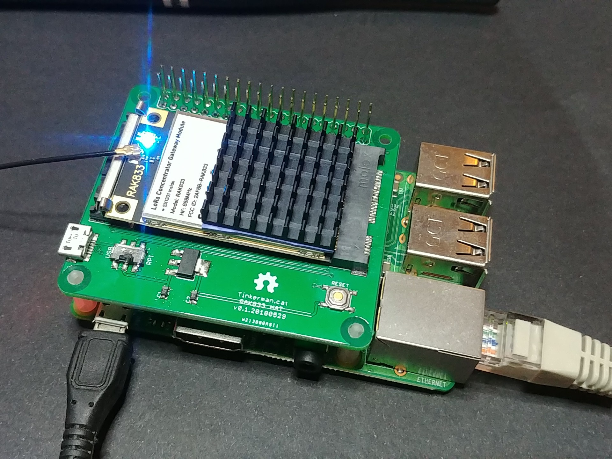

# RAK833 Hat for Raspberry Pi

This repository contains the PCB design for a hat and installation procedure to use a RAK833 MiniPCI-E module with a Raspberry Pi.

## Licenses

The installation procedure is based on the [ttn-zh](http://github.com/ttn-zh) installation procedure for the [IMST iC880a](https://github.com/ttn-zh/ic880a-gateway) module and thus uses the same GPL-3.0 license.

The PCB design and layout is licensed under CC-SA-BY-4.0 International.

License files are available under each folder.
