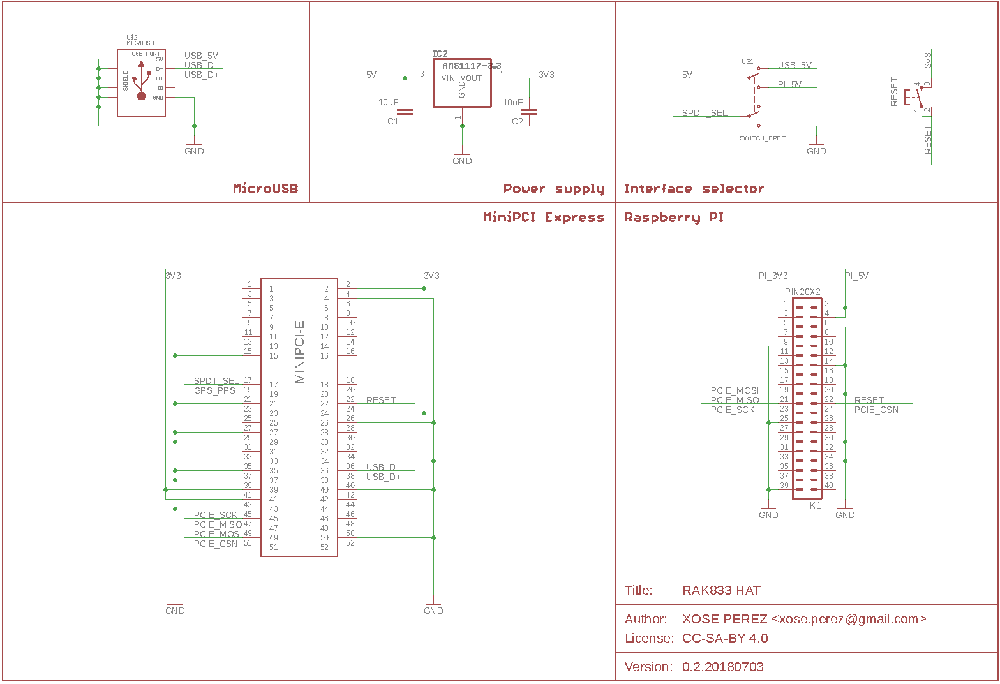
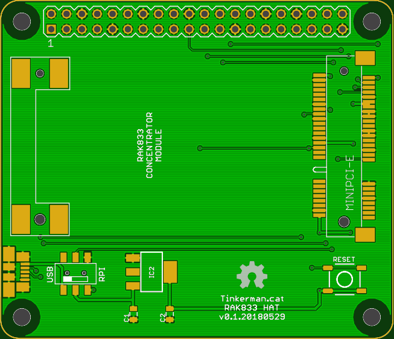

# RAK833 Hat

## Bill of materials

This is the bill of materials for the RAK833 Hat for Raspberry Pi.

You will need an SPI or SPI/USB (more expensive) RAK833 concentrator. RAK Wireless sells them on their Aliexpress store, there is no other place to buy it from IFAIK.

|Item|Qty|Datasheet|Reference|Unit price (*)|
| :--- | :---: | :---: | :---: | :---: |
| RAK833 PCB (lead-free, buying 5 units) | 1 | | [PCBWay](https://www.pcbway.com/project/shareproject/RAK833_Raspberry_Pi_Hat_v0_1_20180529.html) | 3.8€ |
| RAK833 MiniPCI | 1 | [PDF](http://docs.rakwireless.com/en/RAK833%20PCIE%20LoRa%20Gateway/hardware%20design/RAK833%20LoRa%20Gateway%20DataSheet%20V1.3.pdf) | [Aliexpress (SPI-only)](https://www.aliexpress.com/item/RAK833-SPI-SX1301Chip-868-915MHz-Industrial-Grade-Mini-PCIe-LoRa-Gateway-Concentrator-Module-support-SPI-Interface/32887664396.html) [Aliexpress (SPI & USB)](https://www.aliexpress.com/item/RAK833-SPI-USB-Industrial-Grade-Mini-PCIe-LoRa-Gateway-Concentrator-Module-SX1301-FT2232H-Chip-868-915MHz/32867370031.html) | 86.41€ 103.87€ |
| Glass Fiber Antenna Gain 6dbm | 1 | | [Aliexpress](https://www.aliexpress.com/store/product/Glass-Fiber-Antenna-Gain-6dbm-Transmission-range-is-further-LoRa-Gateway-Antenna-with-433-470-868/2805180_32852314761.html) | 24.02€ |
| Molex MiniPCI-E 4.0H connector | 1 | [PDF](https://www.mouser.es/datasheet/2/276/480996701_sd-155861.pdf) | [Mouser (connector)](https://www.mouser.es/ProductDetail/538-67910-1002)   [Mouser (latch)](https://www.mouser.es/ProductDetail/538-48099-5701) | 1.82€ 1.07€ |
| Molex 47346-1001 microUSB connector | 1 | [PDF](https://www.mouser.es/datasheet/2/276/0473461001_IO_CONNECTORS-272892.pdf) | [Mouser](https://www.mouser.es/ProductDetail/538-47346-1001) | 0.55€ |
| AMS1117-3V3 | 1 | | [Aliexpress](https://www.aliexpress.com/item/10pcs-AMS1117-3-3-AMS1117-LM1117-1117-3-3V-1A-Voltage-Regulator/32348815272.html) | 0.03€ |
| 10uF 6.3V Tantalum Capacitors | 2 | [PDF](https://www.mouser.es/datasheet/2/40/tps-776850.pdf) | [Mouser](https://www.mouser.es/ProductDetail/581-TPSR106K006R1500) | 0.60€ |
| SMD DPDT switch | 1 | | [Aliexpress](https://www.aliexpress.com/item/5PCS-3-Position-6-Pins-DPDT-Panel-PCB-Mount-Mini-SMD-SMT-Slide-Switch-7x6x4mm/32553945435.html) | 0.69€ |
| SMD push button | 1 | | [Aliexpress](https://www.aliexpress.com/item/100PC-Lot-SMD-4-4-1-5MM-4X4X1-5MM-Tactile-Tact-Push-Button-Micro-Switch-Momentary/32623940621.html) | 0.01€ |
| Raspberry Pi 3 | 1 | | | ~30€ |
| 20x2 2.54pitch header for Raspberry Pi | 1 | | | ~0.25€ |
| **TOTAL (SPI-only version)** | | | | **~150€** |

(*) Prices are shown here for reference. They might change depending on your supplier. They also change depending on the number of units you buy. All prices excluding shipping or customs.
